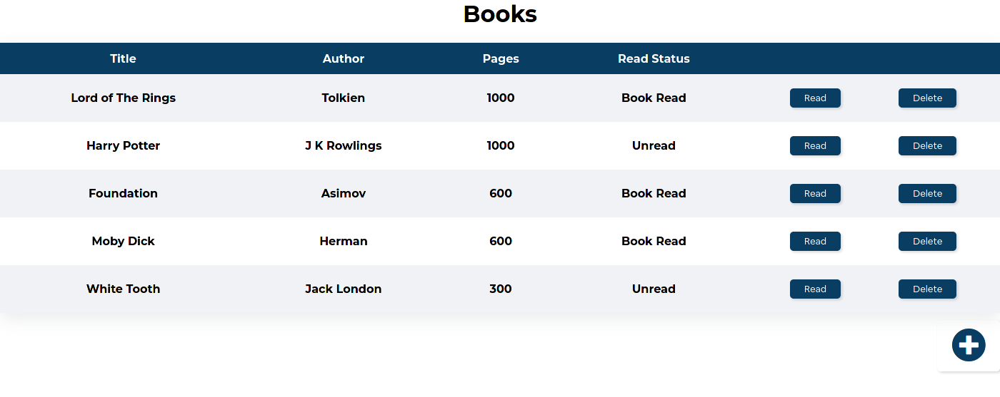

<h1 align="center">
  
</h1>

<h1 align="center">Books Library</h1>
      
<p align="center">
  <a href="#about">About</a> •
  <a href="#getting-started">Getting Started</a> •
  <a href="#contributing">Contributing</a> •
  <a href="#authors">Authors</a>
</p>

---

## About
This projects is a book library. Using the application, a user can store new books and delete the books. The application uses localStorage to store user data.


## Live Demo
[Live Demo](https://smcommits.github.io/book-library/)

## Getting Started

* Clone this repo
    ```
    git clone https://github.com/smcommits/book-library.git
    ```
* Navigate to private-events folder
    ```
    cd book-library
    ```
* To interact with the application, open index.html in your web browser.

## Authors

👤 **Anas Siddiqui**
  - GitHub: [@githubhandle](https://github.com/smcommits)
  - LinkedIn: [linkedIn](https://linkedin.com/in/sm-anas)


👤 **Sinan Sevgi**
  - GitHub: [@sinansevgi](https://github.com/sinansevgi)
  - LinkedIn: [@sinansevgi](https://www.linkedin.com/in/sinansevgi/)
  - Twitter: [@nativeofcybers1](https://twitter.com/nativeofcybers1)
  - Portfolio: [Website](https://sinansevgi.com)


## Contributing

Contributions, issues, and feature requests are welcome!

Feel free to check the [issues page](https://github.com/smcommits/private-events/issues).


## Acknowledgements

Credits go to The Odin Project for providing essential guidance and an opportunity to build this amazing project
  - [**The Odin Project**](https://www.theodinproject.com/home)

## Show your support

Give a ⭐️ if you like this project!


